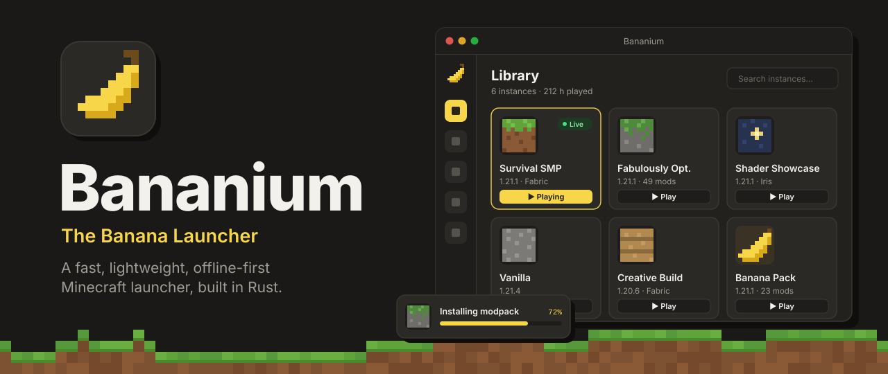
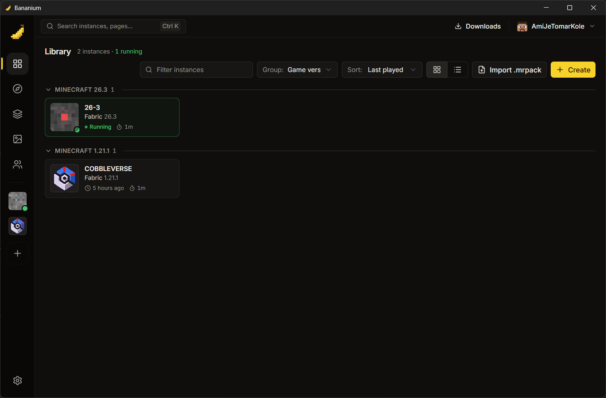
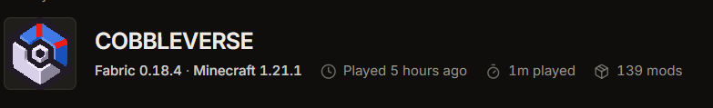
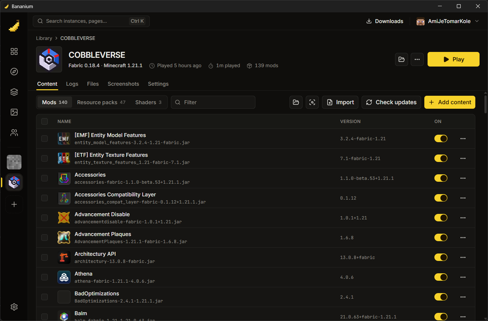
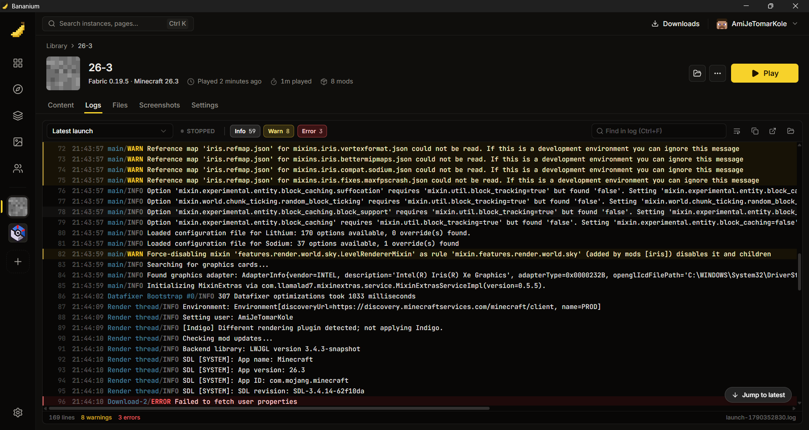
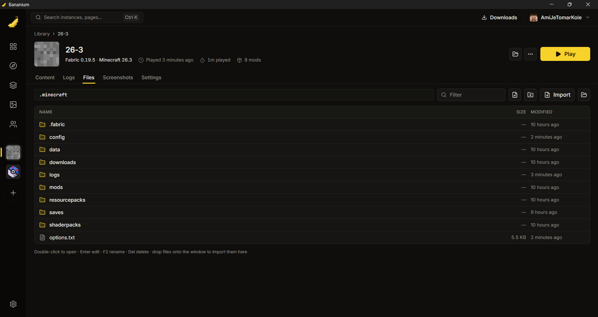
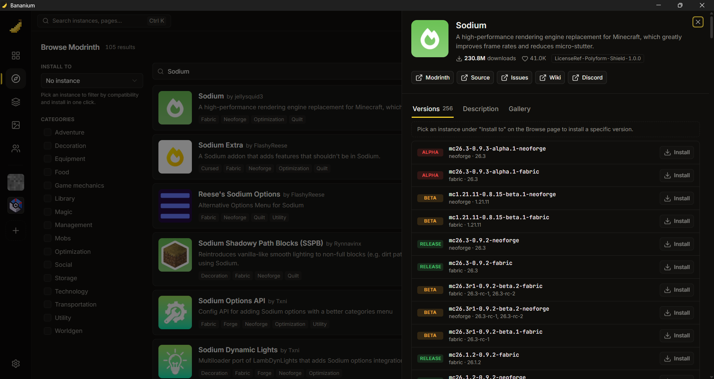
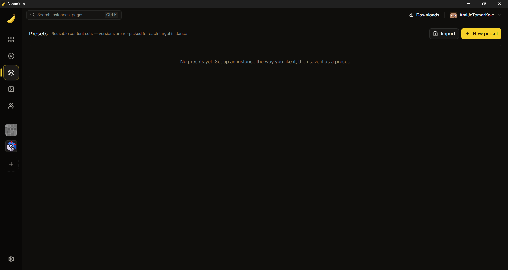
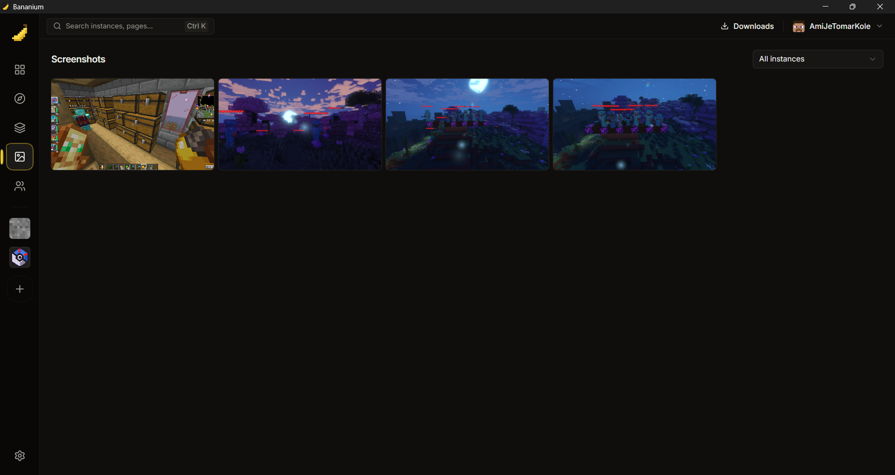

<div align="center">



# Bananium: The Banana Launcher

**A fast, lightweight, offline-first Minecraft launcher.**

Instances, Fabric, Modrinth mods, shaders, resource packs, and modpacks in a
clean desktop app that stays out of your RAM's way.

</div>

---

## Why Bananium?

- **Light on memory.** A Rust core with a small desktop shell. The launcher
  shouldn't be what's eating your RAM.
- **Works offline.** Once an instance is installed, it launches from the local
  cache with no network: on a plane, behind a dead router, anywhere.
- **Official sources only.** Game files and Java runtimes come straight from
  Mojang's own servers. No third-party mirrors.
- **One copy of everything.** Libraries, assets, and mod jars are stored once
  and shared, so ten instances on the same version don't cost ten copies.
- **No Java setup.** Bananium downloads the exact Java runtime Mojang
  publishes for each Minecraft version.
- **Smart mod installs.** Required dependencies come along automatically, with
  version picks that don't break each other.

> **Status:** early development (v0.1.0). Vanilla and Fabric are tested on
> Windows 11 and Linux x86_64. Fabric is the only mod loader supported so far.

---

## The desktop app

The desktop app is the main way to use Bananium. Everything below is built
and working.

### Library



All your instances in one place.

- Grid or list view, grouped by **group**, **loader**, or **game version**.
- Sort by last played, name, game version, or playtime, and filter as you
  type.
- A running badge and a one-click **Play / Stop** on every instance.
- **Create an instance:** pick a name, icon, game version, loader (Vanilla or
  Fabric, with a loader version or "latest stable"), and group. You can also
  start it from a preset.
- **Import a Modrinth modpack** from a `.mrpack` file.

### Instance page



Each instance has a header with its icon, group, last played time, and total
playtime, plus these tabs:

| Tab | What it does |
|---|---|
| **Content** | Mods, resource packs, and shaders. Enable or disable, remove, bulk-select, import local files, identify unknown jars on Modrinth, check for and apply updates, and add new content |
| **Logs** | Live log viewer with Info/Warn/Error filters, search with next/previous match, line wrapping, copy, and a history of past launches |
| **Files** | A file manager for the game folder: browse, create, rename, delete, import, and edit text files in place |
| **Screenshots** | That instance's screenshots |
| **Settings** | Max memory (`-Xmx`), Java override, extra JVM arguments, group, and delete |

<p>
  
  
  
</p>

### Browse Modrinth



Search Modrinth for **mods, resource packs, shaders, and modpacks**.

- Filter by category, and sort by relevance, downloads, follows, newest, or
  recently updated.
- Choose an instance under **Install to** and results are limited to what that
  instance can actually run.
- Open a project to read its description and pick a specific version.
- Install in one click. Required dependencies are resolved for you, and
  installing a shader pack brings in Iris and Sodium automatically.

### Presets



Save an instance's Modrinth content as a preset, then apply it to any other
instance. Versions are re-picked to match each target's Minecraft version.
Presets can be renamed, exported, and imported to share with friends.

### Screenshots



One gallery with every instance's screenshots. Filter by instance, page
through them with the arrow keys, and delete the ones you don't need.

### Accounts

Local offline accounts. Add a username, pick your default, and switch from the
sidebar. Accounts use the standard offline-mode UUID, so they work in
singleplayer, on LAN, and on offline-mode servers. No auth server is ever
contacted.

> Bananium is meant for people who own Minecraft. Please buy the game to
> support Mojang. Signing in with a Microsoft account is under consideration
> for a future release.

### Settings

Theme (dark or light), default Java (automatic uses Mojang's runtime for each
version), installed Mojang runtimes, parallel downloads, Discord Rich
Presence, and quick links to every data folder.

### Discord Rich Presence

With the Discord desktop app open, your profile shows **Playing Bananium**
with what you're up to: the Minecraft version, mod loader, mod count and
username while you play (with the modpack's own icon), or browsing Modrinth
and installing, with a progress bar, while you're in the launcher.

- Every detail has its own switch in **Settings → Discord Rich Presence**,
  with a live preview of the card.
- Hide any single instance from Discord in its **Settings** tab.
- If Discord isn't running, Bananium quietly checks again every 5 seconds,
  so closing Discord and opening it later just works.

### Everywhere in the app

- **Task tray:** installs and downloads with live progress and speed.
- **Command palette (`Ctrl+K`):** jump to any instance or page, or play and
  stop instances.
- **Keyboard shortcuts:**

  | Shortcut | Action |
  |---|---|
  | `Ctrl+K` | Command palette |
  | `Ctrl+N` | New instance |
  | `Ctrl+1` to `Ctrl+5` | Library, Browse, Presets, Screenshots, Accounts |
  | `Ctrl+,` | Settings |

- Right-click menus on instances, content, and files.

---

## How mod versions are picked

Bananium decides compatibility from Modrinth's own metadata:

- **Automatic picks are stable releases only.** You get betas and alphas only
  when you choose that exact version yourself.
- A version must support your instance's Minecraft version and loader. If the
  newest one doesn't, an older stable version is used.
- **Dependencies:** if a mod pins a dependency version, that version is used.
  If it doesn't, Bananium uses the newest stable version released **no later
  than** the mod itself. This prevents crashes like an older Iris breaking on
  a much newer Sodium.
- Declared incompatibilities are checked both ways against what you already
  have installed. A conflicting install either falls back to an older version
  or is refused, with both mods named.
- Updates follow the same rules, so updating one mod never breaks another.

---

## Installing and building

Prebuilt releases aren't published yet, so build from source for now.

### Prerequisites

- [Rust](https://rustup.rs/) (stable)
- [Bun](https://bun.sh/)
- The [Tauri 2 prerequisites](https://v2.tauri.app/start/prerequisites/) for
  your OS (WebView2 on Windows; WebKitGTK and related packages on Linux)

You don't need Java installed. Bananium downloads the right runtime itself.

### Run the desktop app

```sh
cd desktop
bun install
bun run tauri dev          # development
bun run tauri build        # release bundle / installer
```

### Build everything (desktop app, CLI, TUI)

The desktop web bundle has to be built before any workspace-wide `cargo`
command, because the desktop crate embeds `desktop/dist` at compile time:

```sh
cd desktop && bun install && bun run build && cd ..
cargo build --workspace --release
```

This produces the `bananium` (CLI) and `bananium-tui` binaries in
`target/release/`.

---

## Command-line interface

The `bananium` CLI can do almost everything the desktop app does, which makes
it good for scripts, servers, and terminal fans. Both drive the same core and
share the same data folder.

```
bananium [--format-json] <COMMAND>
```

| Global flag | Description |
|---|---|
| `--format-json` | Print machine-readable JSON instead of human-readable text. Works with every command |
| `-h`, `--help` | Help for any command or subcommand |
| `-V`, `--version` | Print the version |

### Overview

| Command | Description |
|---|---|
| [`versions`](#versions) | List installable Minecraft versions |
| [`install`](#install) | Create an instance and download everything it needs |
| [`launch`](#launch) | Launch an instance |
| [`instance`](#instance) | List, configure, rename, clone, and delete instances |
| [`profile`](#profile) | Manage offline accounts |
| [`search`](#search) | Search Modrinth |
| [`content`](#content) | Manage an instance's mods, resource packs, and shaders |
| [`preset`](#preset) | Save and apply content presets |
| [`modpack`](#modpack) | Inspect and install Modrinth modpacks |
| [`java`](#java) | List detected Java installations |
| [`screenshots`](#screenshots) | List screenshots from every instance |
| [`config`](#config) | Show resolved configuration and paths |

### `versions`

List Minecraft versions available from Mojang.

```sh
bananium versions          # releases only
bananium versions --all    # also snapshots, betas, and alphas
```

| Flag | Description |
|---|---|
| `--all` | Include snapshots, betas, and alphas |

### `install`

Create a new instance and download everything it needs to launch, including
the client, libraries, assets, and the matching Mojang Java runtime. After
this, the instance launches fully offline.

```sh
bananium install <VERSION> [--name <NAME>] [--fabric <LOADER>] [--group <GROUP>]
```

| Argument / flag | Description |
|---|---|
| `<VERSION>` | Minecraft version id, e.g. `1.21.1` |
| `--name <NAME>` | Instance name (letters, digits, `-`, `_`). If you leave it out in an interactive terminal, you're prompted, and a blank answer picks a random name. Scripts that leave it out get a random name without a prompt |
| `--fabric <LOADER>` | Also install Fabric: a loader version, or `latest` for the newest stable one |
| `--group <GROUP>` | Library group to file the instance under |

```sh
bananium install 1.21.1 --name survival
bananium install 1.21.1 --name modded --fabric latest --group Fabric
```

A live progress line (downloaded / total, speed, files) is printed to stderr
while the install runs. Several instances can share one version, and the
shared files are only stored once.

### `launch`

```sh
bananium launch [INSTANCE] [--profile <NAME>] [--dry-run]
```

| Argument / flag | Description |
|---|---|
| `[INSTANCE]` | Instance slug. Optional when exactly one instance is installed |
| `--profile <NAME>` | Offline account to play as. Defaults to your default profile |
| `--dry-run` | Print the exact Java command line instead of launching |

```sh
bananium launch survival
bananium launch modded --profile Steve
bananium launch modded --dry-run
```

Java is chosen in this order: the instance's Java setting, then the global
setting, then Mojang's official runtime for that version (downloaded first if
it's missing). Game output goes to a per-launch log file in the instance's
`logs/` folder.

### `instance`

| Subcommand | Description |
|---|---|
| `instance ls` | List every instance and whether it's running |
| `instance set <INSTANCE> [flags]` | Change RAM, JVM arguments, or group |
| `instance rename <INSTANCE> <NEW_NAME>` | Rename an instance |
| `instance clone <INSTANCE> <NEW_NAME>` | Copy an instance, including worlds and mods |
| `instance rm <INSTANCE>` | Delete an instance and **everything in it, worlds included** |

Flags for `instance set`:

| Flag | Description |
|---|---|
| `--ram-mb <MB>` | `-Xmx` heap cap in MB. `0` clears it back to the JVM default |
| `--java-arg <ARG>` | Extra JVM argument, appended after all the others. Repeat the flag to add more. Replaces the whole current list |
| `--clear-java-args` | Remove all extra JVM arguments |
| `--group <GROUP>` | Move to a library group. `""` ungroups it |

```sh
bananium instance set modded --ram-mb 4096 --java-arg=-XX:+UseG1GC --java-arg=-XX:+ParallelRefProcEnabled
bananium instance set modded --clear-java-args
bananium instance clone modded modded-test
bananium instance rename modded-test testing
bananium instance rm testing
```

Leaving out `--java-arg` keeps the current list unchanged. Use
`--clear-java-args` to empty it.

### `profile`

Offline accounts are local usernames that are never checked against an auth
server.

| Subcommand | Description |
|---|---|
| `profile ls` | List profiles. `*` marks the default |
| `profile add <NAME>` | Add a profile (3 to 16 letters, digits, or `_`) |
| `profile rm <NAME>` | Remove a profile |
| `profile default <NAME>` | Use this profile when `launch` has no `--profile` |

```sh
bananium profile add Steve
bananium profile default Steve
```

### `search`

Search Modrinth. Shows up to 20 results.

```sh
bananium search <QUERY> [--kind <KIND>] [--instance <INSTANCE>]
```

| Flag | Description |
|---|---|
| `--kind <KIND>` | `mod` (default), `resource_pack`, or `shader` |
| `--instance <INSTANCE>` | Only show results this instance can use (matching Minecraft version and loader) |

```sh
bananium search sodium --instance modded
bananium search "complementary" --kind shader
```

### `content`

Manage an instance's mods, resource packs, and shader packs.

| Subcommand | Description |
|---|---|
| `content ls <INSTANCE>` | List everything installed |
| `content add <INSTANCE> <PROJECT> [--kind <KIND>]` | Install a Modrinth project (id or slug) and its required dependencies |
| `content rm <INSTANCE> <FILENAME> [--kind <KIND>]` | Remove an installed file |
| `content updates <INSTANCE>` | Show available updates |

`--kind` is `mod` (default), `resource_pack`, or `shader`.

```sh
bananium content add modded sodium
bananium content add modded iris
bananium content add modded complementary-reimagined --kind shader
bananium content add modded faithful-32x --kind resource_pack
bananium content ls modded
bananium content updates modded
bananium content rm modded sodium-fabric-0.6.13+mc1.21.1.jar
```

Versions are picked with the [rules above](#how-mod-versions-are-picked).
Mods and shaders can't be installed on vanilla instances.

### `preset`

| Subcommand | Description |
|---|---|
| `preset ls` | List presets |
| `preset save <INSTANCE> <NAME>` | Save an instance's Modrinth content as a preset |
| `preset apply <PRESET> <INSTANCE>` | Install a preset's content into an instance, re-picking versions for it |
| `preset rm <NAME>` | Delete a preset |

```sh
bananium preset save modded performance
bananium preset apply performance another-instance
```

### `modpack`

Modrinth modpacks (`.mrpack`). Only Fabric and vanilla packs are supported.
Forge, NeoForge, and Quilt packs are refused.

| Subcommand | Description |
|---|---|
| `modpack info <FILE>` | Show what a local `.mrpack` needs (Minecraft version, loader, files) |
| `modpack install <SOURCE> [flags]` | Create an instance from a local `.mrpack` or a Modrinth project id/slug |

Flags for `modpack install`:

| Flag | Description |
|---|---|
| `--version <ID>` | Modrinth version id. Defaults to the newest stable release |
| `--name <NAME>` | Instance name. Defaults to the pack's name |
| `--group <GROUP>` | Library group for the new instance |

```sh
bananium modpack info ./pack.mrpack
bananium modpack install fabulously-optimized
bananium modpack install ./pack.mrpack --name my-pack --group Packs
```

Every pack file is SHA-1 verified, and the pack's overrides and icon are
applied.

### `java`

```sh
bananium java
```

Lists every JVM found on the system and every Mojang runtime Bananium has
downloaded.

### `screenshots`

```sh
bananium screenshots
```

Lists screenshots from every instance.

### `config`

```sh
bananium config show
```

Prints the resolved data paths (home, config, store, instances, Java, assets)
and the active settings (`max_concurrent_downloads`, `theme`, `java_path`).

### Scripting

Every command accepts `--format-json`:

```sh
bananium --format-json instance ls
bananium --format-json content updates modded
```

---

## Terminal UI

There's also a small terminal interface, `bananium-tui`, with an instance
list, launching, and a RAM/JVM-args editor.

| Key | Action |
|---|---|
| `j` / `k`, `↓` / `↑` | Move |
| `Enter` | Launch |
| `e` | Edit RAM and JVM arguments |
| `r` | Refresh |
| `q` / `Esc` | Quit |

---

## Where your data lives

Everything goes in one folder, which is easy to back up or move. Bananium
looks for it in this order:

1. The `BANANIUM_HOME` environment variable, if set
2. A `bananium/` folder next to the executable (portable mode)
3. `~/.bananium` (`%USERPROFILE%\.bananium` on Windows)

```
.bananium/
  config.toml                  global settings
  profiles.toml                offline accounts
  store/                       shared, deduplicated game files and mods
  java/                        Mojang Java runtimes
  meta/                        cached Mojang + Fabric metadata (for offline use)
  assets/                      game assets
  presets/                     saved presets
  instances/<name>/
    instance.toml              version, loader, memory, JVM args, Java, group, icon
    bananium.lock.toml         installed Modrinth content
    minecraft/                 the game folder (mods, saves, resourcepacks, ...)
    logs/                      one log file per launch
```

To try Bananium without touching your real data:

```sh
BANANIUM_HOME=/tmp/bananium-test bananium install 1.21.1
```

---

## Architecture

Bananium is a Cargo workspace. All the logic lives in UI-free library crates,
and every frontend (desktop, CLI, TUI) talks to a single facade crate,
`bananium-api`, by sending `Command`s and listening for `Event`s:

```
                    bananium-api
        Session::dispatch(Command) -> CommandOutput
        Session::events()          -> Stream<Event>
            |               |              |
    bananium-desktop   bananium-cli   bananium-tui
```

| Crate | Role |
|---|---|
| `bananium-api` | The frontend facade: `Command`, `Event`, `Session` |
| `bananium-core` | Paths, layered config, errors, logging |
| `bananium-net` | HTTP client and resumable, checksum-verified downloads |
| `bananium-store` | Content-addressed file store (reflink → hardlink → copy) |
| `bananium-meta` | Mojang and Fabric metadata, library rules, assets |
| `bananium-java` | Mojang Java runtimes and system JVM detection |
| `bananium-modrinth` | Modrinth API client |
| `bananium-instance` | Instances, content lockfile, presets |
| `bananium-launch` | Classpath, natives, launch arguments, offline UUIDs |
| `desktop/` | Tauri 2 + React + TypeScript + shadcn/ui desktop app |
| `bananium-cli`, `bananium-tui` | Terminal frontends |

Frontends may depend only on `bananium-api`. `scripts/check_frontend_deps.py`
enforces this. The desktop app's TypeScript types in `desktop/src/bindings/`
are generated from the Rust types with ts-rs.

---

## Contributing

Contributions are welcome. See [CONTRIBUTING.md](CONTRIBUTING.md) for how the
project is laid out, the rules every change has to follow, and the checks to
run before opening a pull request.

---

## License

Licensed under the [MIT License](LICENSE).

Bananium is not affiliated with or endorsed by Mojang Studios or Microsoft.
Minecraft is a trademark of Mojang Studios.
